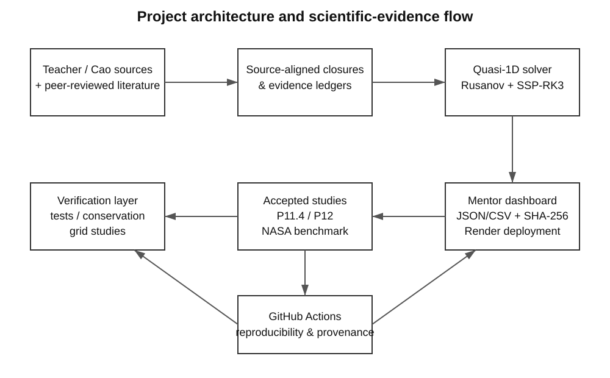
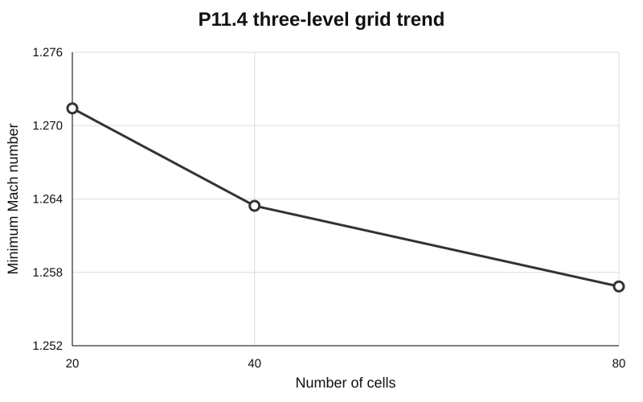
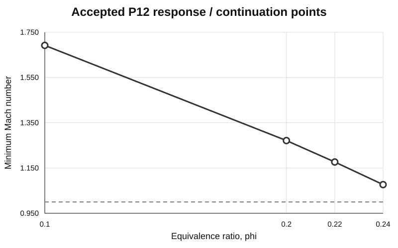
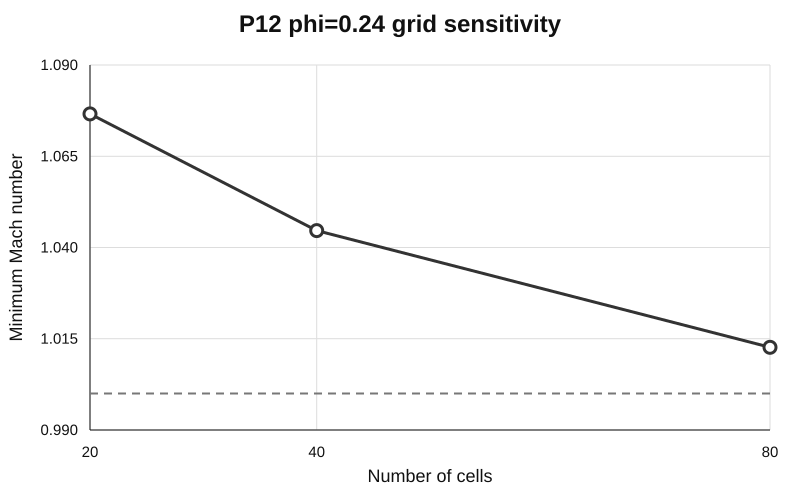

# 基于教师参考模型的超燃/双模态冲压发动机准一维 CFD 求解器开发、验证与工程化实现

**版本：v0.1（2026-09-27）**  
**项目仓库：LBW-and-YBW-**  
**论文性质：持续维护的项目主论文初稿**

## 摘要

针对超燃冲压发动机与双模态冲压发动机快速性能分析、课程设计与控制研究中对低成本、高可解释性数值工具的需求，本文开发了一套面向燃烧室准一维流动的可复现 CFD 求解与证据管理框架。项目以教师提供的《高超声速气动布局理论及应用》第 11 章“双模态冲压发动机一维数值模拟”以及曹瑞峰博士学位论文《超燃冲压发动机燃烧模态转换及其控制方法研究》为主要模型依据，在有限体积框架下求解准一维可压缩守恒方程，并逐步集成变截面、壁面摩阻、燃料喷注、混合/燃烧效率、变组分热化学、边界条件、伪时间推进和稳态收敛判据。当前 H₂/C₂H₄ 教师路径采用 Rusanov 数值通量、SSP-RK3 时间积分和教师 Eq.11.46 最大相对密度变化作为主要稳态诊断；教师 Steger-Warming 公式保留为独立审计路径，但由于变热化学绝对组分能量参考下的生产级兼容性尚未得到教师/Cao 来源的直接闭合，当前未强制替换已验证的 Rusanov 生产路径。

为避免将“代码能运行”误当作“物理模型被验证”，项目将数值验证、模型确认、源资料复现和项目自定义敏感性研究严格区分。已完成的证据包括：项目定义 H₂ 综合算例、20/40/80 三层网格趋势、离散质量/动量/能量库存率审计、NASA Burrows-Kurkov 公开资料驱动的降阶计算参考 benchmark、当量比响应计算、基于曹瑞峰 Eq.(3-2) 的热喉判据应用、GitHub Actions 自动回归测试以及面向导师使用的 Web 控制台。20/40/80 网格结果表明，关键极值随网格加密持续变化但差异逐步缩小，因此本文仅声明“网格收敛趋势”，不宣称已达到严格渐近区或 GCI 意义下的网格无关。P12 项目定义 H₂ 响应研究中，φ=0.10、0.20 可在项目选定的 2×10⁻⁵ Eq.11.46 数值容差下收敛；采用组成一致 warm-start 后，φ=0.22、0.24 也可收敛并保持在所采用的 Cao Eq.(3-2) scram-side 范围内，而 φ=0.26 触发当前正向流摩阻适配器的模型域保护。该保护仅解释为“求解器/模型域不可接受”，不被直接解释为 unstart 或燃烧模态转换。

工程实现方面，项目建立了机器可读 acceptance JSON、来源/假设 ledger、运行 commit/workflow/artifact/SHA-256 provenance，并提供本地和 Render 部署的导师控制台，可查看已接受结果、运行冻结算例、导出 JSON/CSV 及完整性摘要。本文同时明确保留若干 source-gated 问题：教师 Eq.11.26 壁面换热经验多项式到 Eq.11.38 能量源项的唯一有量纲映射、变热化学 Steger-Warming 生产兼容性、C10H22 热化学、Cao Case 2 精确 A(x)、Yi(x) 与源项空间约定，以及完整隔离段/激波串模态分类变量。研究表明，在课程与本科阶段工程研究尺度上，采用“来源分级—公式审计—单元测试—数值验证—证据冻结—可视化交付”的开发路线，可以显著提高准一维超燃冲压数值项目的可复现性与科学可辩护性。

**关键词：** 超燃冲压发动机；双模态冲压发动机；准一维 CFD；有限体积法；变热化学；数值验证；燃烧模态；可复现计算

## Abstract

A reproducible quasi-one-dimensional CFD and evidence-management framework is developed for rapid analysis of scramjet and dual-mode ramjet combustors. The teacher-provided Chapter 11 model and the doctoral dissertation of Ruifeng Cao are treated as the primary project authorities. The solver integrates variable-area compressible conservation equations, wall-friction and fuel-injection source terms, mixing/combustion closures, composition-dependent thermochemistry, teacher-compatible boundary conditions, SSP-RK3 pseudo-time marching, and the Eq.11.46 maximum relative density-change diagnostic. The current integrated H₂/C₂H₄ production path uses a Rusanov interface flux. The teacher Steger-Warming formulation is retained as an audited constant-property path, while its direct production use with the current absolute-species-energy thermochemistry remains gated pending an explicit compatibility derivation.

The project separates numerical verification, model validation, source reproduction, and project-defined sensitivity studies. Accepted evidence includes an integrated project-defined H₂ case, 20/40/80-cell grid-trend analysis, discrete conservation audits, a NASA Burrows-Kurkov reduced-order computational-reference benchmark, equivalence-ratio response studies, scoped application of the Cao thermal-throat criterion, automated regression testing, and a mentor-facing web dashboard. The project deliberately avoids claiming formal grid independence, exact Cao Case 2 reproduction, experimental validation of the current project-defined H₂ case, or complete dual-mode/unstart prediction where the required source variables are unavailable. Machine-readable acceptance records, provenance metadata, GitHub Actions and SHA-256 artifact integrity are used to make each accepted conclusion traceable and reproducible.

**Keywords:** scramjet; dual-mode ramjet; quasi-one-dimensional CFD; finite-volume method; thermochemistry; verification; combustion-mode transition; reproducibility

---

## 1 引言

超燃冲压发动机通过在高速来流条件下维持燃烧室内高马赫数流动实现高超声速推进，是高超声速飞行器的重要动力方案之一。与二维/三维 RANS、LES 或更高保真度数值模拟相比，准一维模型不能解析横向涡结构、边界层细节和复杂激波-燃烧相互作用，但其计算成本低、参数含义清晰，适合用于前期方案设计、参数敏感性分析、控制研究和大量工况快速计算[3-10]。

本文项目的目标并非构建一个“功能越多越好”的黑箱求解器，而是建立一条可追溯的计算链：任何物理模型必须区分教师来源、公开论文来源与项目自定义假设；任何数值结论必须能够追溯至输入、代码版本、工作流和结果文件；对缺少资料的公式不使用经验猜测补齐。该开发思想与 CFD 验证/确认领域强调的“verification 与 validation 分离”相一致[11,17]。

本项目最初从理想气体、一维 Euler 方程和基础数值通量开始，随后逐步发展为以教师 Chapter 11 为主线的 H₂/C₂H₄ 准一维燃烧室求解器。当前系统已经不仅包含数值求解模块，还包括源资料审计、热化学数据库、教师公式适配器、网格与守恒验证、公开 NASA benchmark、自动化 CI、结果 provenance、Web 导师控制台以及后续参数研究框架。图 1 给出了整体科学证据和软件架构。

## 2 模型来源与证据分级

### 2.1 主要来源

本项目的首要模型来源为教师提供的《高超声速气动布局理论及应用》第 11 章“双模态冲压发动机一维数值模拟”[1]。其中使用了混合效率、完全混合长度、化学计量关系、壁面摩阻、壁面换热经验式、燃料/动量/能量源项、Steger-Warming 通量分裂、CFL 时间步以及稳态判据等关系。

第二类主要来源为曹瑞峰 2016 年博士学位论文《超燃冲压发动机燃烧模态转换及其控制方法研究》[2]。本项目已经冻结了该论文 Case 2 的入口条件与 Eq.(3-2) 热喉判据，但尚未获得正式复现所需的完整 A(x)、Yi(x) 空间分布与燃料/源项空间约定，因此项目定义 H₂ 算例始终标记为 PROJECT_DEFINED，而不是 Cao Case 2 reproduction。

### 2.2 外部同行评议文献的作用

公开文献主要用于三类用途。第一类是证明准一维 scramjet 模型、混合受限燃烧、壁面摩阻、燃料喷注与热交换等处理属于已建立的工程建模路线[5-10]。第二类是用于数值方法与 Steger-Warming 扩展的背景审计[12-15]。第三类是用于验证燃烧模态转换边界并非一个脱离几何、壁面状态和喷注方式的“通用 φ 阈值”[3,4]。

本文不允许外部文献覆盖教师公式，也不允许从另一篇论文直接拷贝缺失系数来“补齐”教师模型。外部来源仅在状态变量、假设和适用范围明确兼容时才可进入生产路径。

## 3 准一维控制方程与物理闭合

### 3.1 守恒形式

基础守恒变量写为

\[
\mathbf{U}=[\rho,\rho u,\rho E]^T ,
\]

物理通量为

\[
\mathbf{F}=[\rho u,\rho u^2+p,u(\rho E+p)]^T .
\]

变截面准一维形式为

\[
\frac{\partial(A\mathbf{U})}{\partial t}
+\frac{\partial(A\mathbf{F})}{\partial x}
=
\begin{bmatrix}
0\\
p\,\mathrm{d}A/\mathrm{d}x\\
0
\end{bmatrix}
+A\mathbf{S}_{ng},
\]

其中 \(\mathbf{S}_{ng}\) 表示摩阻、燃料喷注、壁面外加热等非几何源项。项目使用单元中心有限体积离散，并保证面积通量项与几何压力源项使用一致的面面积差，从而使任意合法变截面上的静止等压状态保持离散平衡。

### 3.2 燃料喷注与 Eq.11.38 源项

燃料注入采用质量、轴向动量和总焓三个守恒通道：

\[
\mathbf{S}_{fuel}
=
[\dot{\rho}_f,\dot{\rho}_f u_{f,x},
\dot{\rho}_f h_{t,f}]^T .
\]

在教师单喷注器适配器中，离散源项积分必须回收预设的燃料总质量流量。项目测试还要求喷注强度与只影响混合长度的参数变化相互独立，防止敏感性研究同时改变多个输入。

### 3.3 混合/燃烧效率

教师 Eq.11.18 将燃烧效率定义为已燃燃料占注入燃料的比例，因此物理范围为 \(0\le\eta\le1\)。Eq.11.19 给出平行、法向和支板喷注的混合效率经验关系，Eq.11.20 给出完全混合长度并给出 \(C_m=25\sim60\) 的来源范围。

为避免修改原始经验关系，代码首先保留原始混合相关式 \(\eta_{m,raw}\)，随后在单独的项目适配层使用

\[
\eta=\min(\eta_{m,raw},1)
\]

将其解释为物理燃烧效率。该截断属于“项目 adapter policy”，而不是对 Eq.11.19 本身的改写。

### 3.4 化学计量与变组分热化学

教师 Eq.11.21-11.24 的通用烃燃料化学计量燃空比写为

\[
f_{st}=\frac{36x+3y}{103(4x+y)} ,
\]

其中燃料表示为 \(C_xH_y\)。代码对 H₂、C₂H₄ 和 C₁₀H₂₂ 的教材参考值进行回归测试，并通过 C/H/O/N/Ar 元素守恒独立检查反应组分关系。

当前变热化学数据库覆盖 H₂、O₂、N₂、Ar、H₂O、C₂H₄ 和 CO₂。热物性采用源可追溯 NASA 多项式/GRI-Mech 3.0 数据，分子量和 298 K 比热另有独立交叉核对。C₁₀H₂₂ 尚未获得与当前冻结热化学约定兼容的来源，因此仍处于 source-gated 状态。

### 3.5 壁面摩阻与换热

教师 Eq.11.25 给出 \(z=\phi\eta\) 的摩阻经验多项式。教师归一化动量源项

\[
-\frac12\rho u^2\frac{4f}{D_e}
\]

被严格映射到项目使用的 Darcy 形式，其中正向流条件下

\[
f_D=4f,\qquad D_h=D_e .
\]

该映射已经通过逐项数值测试验证。

教师 Eq.11.26 的壁面换热经验多项式虽然已完整转录，但现有教师/Cao 资料以及外部文献检索尚未给出其到 Eq.11.38 中 \(d(\delta q)/dx\) 的唯一有量纲关系。项目因此保留一个显式 wall-specific-heat-gain-gradient 输入通道，但 H₂ 项目基线将其置零，并明确标记为 SOURCE_GATED_NEUTRALIZATION，而不是“已验证绝热壁”。

## 4 数值方法

### 4.1 有限体积与 Rusanov 生产通量

当前 H₂/C₂H₄ 综合路径使用 Rusanov 界面通量

\[
\hat{\mathbf{F}}
=
\frac12(\mathbf{F}_L+\mathbf{F}_R)
-\frac12\alpha(\mathbf{U}_R-\mathbf{U}_L),
\]

其中 \(\alpha\) 由局部最大特征波速确定。该方法数值耗散较强，但在当前变组分绝对能量表述下具有明确守恒形式和较高鲁棒性。

### 4.2 Steger-Warming 路径

教师 Eq.11.42-11.44 的 Steger-Warming Flux Vector Splitting 已完成公式转录和常比热理想气体极限回归。问题在于：当前生产模型使用 \(c_p(T,Y)\) 与绝对组分能量，而经典能量分裂在这一状态定义下不能直接保证与物理 Euler 能量通量严格重构。

外部文献表明，real-gas、多组分和非平衡条件下确实存在广义 Steger-Warming/FVS 理论[12-15]。因此当前问题不是“学术界不存在方法”，而是尚未证明这些广义公式与本项目三方程+代数组分闭合的状态向量、能量参考和教师 Eq.11.44 数值平滑策略完全兼容。在完成专门推导和验证前，生产路径继续使用 Rusanov。

### 4.3 时间推进与稳态判据

时间积分采用三阶 SSP-RK3。教师 Eq.11.45 的谱半径项包含

\[
0.5\Delta x/\max(|u|+c),
\]

因此生产教师路径使用 CFL=0.5。由于教师资料未冻结 \(dt_0\) 的具体数值，代码仅提供可选显式 dt cap，而不设置猜测默认值。

教师 Eq.11.46 的主要稳态诊断写为

\[
\varepsilon_\rho
=
\max_i
\left|
\frac{\rho_i^{n+1}-\rho_i^n}{\rho_i^n}
\right|.
\]

需要强调的是，Eq.11.46 定义的是“指标”，而不同研究中使用的 10⁻⁴ 或 2×10⁻⁵ 是项目冻结的数值容差，并非本文宣称的教师统一阈值。另行计算的 normalized residual 只作为独立稳健性诊断，不引入未来源化的硬阈值。

## 5 软件实现与可复现性架构

项目采用模块化 Python 包结构，将基础状态转换、数值通量、几何、边界条件、源项、教师闭合、热化学、研究算例与证据记录分离。每一个高层研究均具有以下组成：

1. 机器可读输入/来源 ledger；
2. 求解器或 study generator；
3. 单元/回归测试；
4. GitHub Actions 专用 workflow；
5. acceptance JSON；
6. commit、workflow run、artifact ID 与 SHA-256 provenance；
7. 面向导师展示的 Web 控制台。

该结构使“科研结论”和“软件当前状态”可以分别审计。例如，历史 ledger 中的早期 'ready=false' 不被直接覆盖，而是保留为历史阶段状态，同时增加 'current_status' 指向后续验证证据，以避免篡改研发历史。

## 6 数值验证与参考 benchmark

### 6.1 P11.4 项目定义 H₂ 综合基线

当前项目定义 H₂ baseline 使用 0.40 m 轴向长度、0.0040-0.0050 m² 线性扩张面积、固定 0.040 m 矩形高度、入口 \(p=55\) kPa、\(T=800\) K、\(u=1250\) m/s、\(\phi=0.20\)、喷注位置 0.08 m 和 \(C_m=30\)。其中绝大多数几何/工况参数均为 PROJECT_DEFINED，而 \(C_m=30\) 只是位于教师给出的 25-60 范围内，并非教师指定值。

20-cell 历史 smoke acceptance 在 Eq.11.46 容差 10⁻⁴ 下于 343 步收敛，得到最低/最高 Mach 约 1.279/2.242，最高温度约 1577 K，最高压力约 113.5 kPa。随后使用更严格的 2×10⁻⁵ 项目数值容差开展 20/40/80 网格研究。

### 6.2 20/40/80 网格趋势

三层网格均满足所选 Eq.11.46 数值容差。结果如表 1 所示。

| 网格数 | 最小 Mach | 最大 Mach | 最大压力/kPa | 最大温度/K |
|---:|---:|---:|---:|---:|
| 20 | 1.27141 | 2.24151 | 114.467 | 1580.05 |
| 40 | 1.26344 | 2.24879 | 115.474 | 1584.81 |
| 80 | 1.25685 | 2.25190 | 116.260 | 1588.15 |

从 20→40 与 40→80 的关键极值变化总体减小，但观测收敛行为尚不足以支持严格渐近 GCI 声明，因此本文只表述为“grid-convergence trend”。

### 6.3 离散守恒审计

项目不只检查“结果看起来合理”，还直接对求解器同一 semi-discrete RHS 进行全域体积分，计算质量、动量和能量库存率：

\[
\dot{\mathbf{I}}=
\sum_i \mathbf{RHS}_i A_i\Delta x .
\]

随后分别以入口质量流率、动量流率和总能流率进行无量纲化。质量库存使用项目定义的 0.5% QA 门槛；该值不是教师、NASA、ASME 或论文给出的普适阈值。动量和能量只报告定量诊断，不人为设置没有来源的硬标准。

### 6.4 NASA Burrows-Kurkov 降阶计算参考 benchmark

Burrows 与 Kurkov 的 NASA TM X-2828 提供了超声速氢燃烧实验数据[11]。由于公开实验出口是强非均匀探针分布，而本项目求解器输出为横截面降阶状态，项目没有将探针数据强行平均为单一“实验 Mach/温度”作为验证门槛。正式 benchmark 改为使用 NASA Wind-US 公开参考解构造守恒矩匹配的入口、能量/动量净源项与出口目标。

80-cell 主算例收敛并保持全程超声速，出口 Mach=2.41720、静压=87.923 kPa、静温=1269.74 K；守恒目标为 Mach=2.43106、静压=87.198 kPa、静温=1263.23 K。40/80/160/320 网格研究中，320-cell 相对守恒目标误差约为 Mach -0.567%、压力 +0.827%、温度 +0.512%，且 160→320 的相对变化约为 10⁻⁵ 量级。该证据支持“降阶数值/守恒闭合 consistency benchmark”，但不被宣称为当前项目 H₂ 变热化学模型的独立实验验证。

## 7 P12 当量比响应与热喉判据应用

### 7.1 项目定义响应

在相同项目定义几何与数值控制下，P12 对当量比进行响应研究。φ=0.10 与 φ=0.20 均在项目选定的 2×10⁻⁵ Eq.11.46 容差下收敛。

| φ | 状态 | 最小 Mach | 最大 Mach | 最大压力/kPa | 最大温度/K | 质量库存/入口 |
|---:|---|---:|---:|---:|---:|---:|
| 0.10 | CONVERGED | 1.69190 | 2.24670 | 74.994 | 1195.81 | 3.38×10⁻⁴ |
| 0.20 | CONVERGED | 1.27141 | 2.24151 | 114.467 | 1580.05 | 4.61×10⁻⁴ |
| 0.30 | INADMISSIBLE* | - | - | - | - | - |

φ=0.30 触发正向流摩阻适配器保护。表中 INADMISSIBLE* 表示 solver/model-domain inadmissible。该事件没有被解释为 unstart、ram mode 或 dual-mode transition。

### 7.2 warm-start continuation

为减少冷启动对非线性响应研究的影响，采用组成一致 warm-start 继续计算 φ=0.22 与 0.24。四个已接受点的最低 Mach 如图 3 所示。

结果为：φ=0.20 时 min(Ma)=1.2714，φ=0.22 时为 1.1766，φ=0.24 时为 1.0766。φ=0.26 仍触发现有模型域保护。

### 7.3 Cao Eq.(3-2) 热喉判据

曹瑞峰博士论文将固定来流条件下的热喉是否达到临界状态作为后续两类模式分析的重要判据[2]。当前项目仅在“解已经收敛且模型域可接受”的情况下应用该判据：

- \(\min Ma(x)>1\)：记为 scoped SCRAM_SIDE；
- 热喉临界 \(Ma=1\)：转换边界；
- \(\min Ma(x)<1\)：在来源定义范围内可进入 ram-side 分析。

在 φ=0.24 的 20/40/80 网格上，最低 Mach 分别为 1.07661、1.04463、1.01267，均位于 scram side，但随网格加密向 1 接近；φ=0.26 在三层网格均触发当前 forward-flow guard。因此本文不宣称已经得到网格无关的转换当量比。

Cao 等后续同行评议研究指出，燃烧模态转换边界会随燃烧室面积分布、热释放分布、壁温/粗糙度和来流成分而变化[3]；实验研究亦显示燃料类型、喷注构型、总温和喷注分布会影响转换[4]。因此当前项目定义几何中的 φ 值不应被推广为通用双模态边界。

## 8 导师控制台与工程化交付

项目开发了面向非代码用户的导师控制台，并部署在 Render。控制台只公开已经冻结的研究路径，避免通过 UI 随意改变尚未完成科学验证的输入。当前可查看：

- 课程交付状态与 provenance；
- H₂ 项目定义 baseline；
- Eq.11.46 收敛指标；
- 20/40/80 网格趋势；
- 质量/动量/能量库存诊断；
- P12 当量比响应；
- warm-start 与热喉网格敏感性；
- Cao Case 2 source blockers；
- 当前主要模型局限。

运行页面目前只暴露若干冻结算例。生成的 baseline/response JSON 自带 UTC 时间、Python/科学计算依赖版本和 Render Git identity；80-cell profile 另有 manifest，并记录 CSV/JSON 的 SHA-256。Render 临时磁盘上的结果不自动成为“科学证据”，只有经过人工审查并冻结进 repository evidence workflow 的结果才被视为 accepted evidence。

## 9 当前功能汇总

截至 v0.1，项目已实现的主要功能如下：

| 类别 | 当前实现 |
|---|---|
| 基础方程 | 一维/准一维可压缩质量-动量-能量守恒 |
| 几何 | 任意合法单元/面面积分布、面积源项 |
| 数值通量 | Rusanov 生产路径；Steger-Warming 审计路径 |
| 时间积分 | SSP-RK3 |
| 时间步 | CFL 波速控制；教师 Eq.11.45 spectral factor |
| 稳态诊断 | Eq.11.46 最大相对密度变化 + 独立 normalized residual |
| 边界 | 教师静态 p/T/u 入口、出口外推；基础超声/亚声边界模块 |
| 燃料喷注 | 质量、轴向动量、总焓源项 |
| 混合 | 平行/法向/支板 Eq.11.19；Eq.11.20 完全混合长度 |
| 化学计量 | Eq.11.21-11.24 与 lean H₂/C₂H₄ 组成 |
| 热化学 | H₂/O₂/N₂/Ar/H₂O/C₂H₄/CO₂ 变热物性 |
| 摩阻 | Eq.11.25 + \(f_D=4f\) 教师适配 |
| 壁面热源 | 显式有量纲输入通道；Eq.11.26 映射仍 gated |
| 验证 | 单元测试、网格趋势、守恒审计、NASA benchmark |
| 模态研究 | Cao Eq.(3-2) scoped thermal-throat criterion |
| 参数研究 | P12 φ 响应；P13 \(C_m\) 敏感性协议已建立、尚未形成 accepted 数值结果 |
| 可复现性 | acceptance JSON、source ledger、GitHub Actions、artifact SHA-256 |
| 展示 | 导师 Web 控制台、本地/Render 运行、CSV/JSON 下载 |

## 10 主要局限与未解决问题

### 10.1 Eq.11.26 有量纲映射

Eq.11.26 多项式已正确转录，但目前未找到能够同时说明物理意义、单位及其到 Eq.11.38 \(d(\delta q)/dx\) 的唯一来源链。Eckert/reference-enthalpy 或 regenerative-cooling 文献虽然可以建立另一套壁面换热模型，但那属于新模型，而不是恢复教师 Eq.11.26。

### 10.2 变热化学 Steger-Warming

广义真实气体/多组分 FVS 文献证明理论路线存在[12-15]，但当前尚缺对本项目状态向量、绝对能量参考与代数组分闭合的兼容性推导。后续若实现，应至少验证：通量重构、能量参考不变性、常比热极限、接触面行为、正性和 smooth-case 收敛阶。

### 10.3 Cao Case 2 正式复现

已冻结的来源数据包括 H₂、Ma=2.12、ρ=0.28 kg/m³、p=46.7 kPa、T=521 K、u=977 m/s、γ=1.33、φ=0.2、入口组分、Tw=900 K 和报告网格间距。但仍缺少精确 A(x)、预设 Yi(x) 规则和原始源项/喷注空间约定。因此不能用当前项目定义几何替代正式复现。

### 10.4 完整双模态/unstart 分类

当前燃烧室模型缺少与曹论文 Table 3-1 完全兼容的隔离段/激波串状态变量和几何。只有 Eq.(3-2) scoped thermal-throat indicator 可以在满足适用条件时使用。forward-flow guard、单一 Mach 值或非收敛本身都不能独立定义物理模态。

## 11 后续工作

1. 完成 P13 教师来源范围 \(C_m=25\sim60\) 的敏感性研究，并在 20/40 网格上检查结论稳健性；
2. 在不改变模型边界的条件下扩展入口 Mach、喷注位置等 one-factor-at-a-time 参数研究，并严格标注 source-anchored 与 project-defined 输入；
3. 若获得教师 Eq.11.26 完整定义，建立并验证有量纲壁面热源适配器；
4. 若获得 Cao Case 2 精确几何/组分/源项空间信息，建立独立 formal reproduction 分支；
5. 对 generalized Steger-Warming 建立专门的状态向量与 Jacobian 推导，并通过常比热极限、smooth manufactured case、shock/nozzle 及生产 baseline 回归后再考虑切换；
6. 若需要完整燃烧模态分类，加入来源兼容的 isolator/shock-train 低阶模型与相应实验/论文验证；
7. 将论文与 acceptance/evidence 记录建立自动版本映射，每次新增正式 accepted evidence 时同步更新本文结果章节。

## 12 结论

本文完成了一套面向超燃/双模态冲压发动机燃烧室的准一维 CFD 求解与可复现科研工作流。项目的核心价值不仅在于实现变截面、喷注、摩阻、混合/燃烧、变热化学和数值推进，还在于建立了明确的科学边界：来源能够证明的内容才进入 source-backed 模型；项目自行选择的参数被明确标为 project-defined；求解器保护和非收敛不被直接解释为物理模态；缺少关键来源的公式保持 gated，而不是通过“看起来合理”的经验补齐。

现有项目定义 H₂ teacher path 已通过基础回归、三层网格趋势与离散守恒审计，并能够开展当量比响应和受限的 Cao thermal-throat criterion 应用。NASA Burrows-Kurkov 路线则作为**独立的 supporting reduced-order computational-reference benchmark**，用于验证项目的降阶数值/守恒处理与公开数据 provenance；它不被用来声称当前 H₂ 变热化学 teacher path 已获得独立实验验证。导师控制台、GitHub Actions、机器可读 acceptance/provenance 与 SHA-256 完整性记录进一步使项目从“单机脚本”发展为可重复运行、可审查和可持续维护的工程计算系统。

因此，在当前证据范围内，可以将本项目定位为一套达到课程/本科工程研究交付要求、具有明确科学边界和继续扩展能力的准一维 scramjet CFD 平台；而 Eq.11.26、变热化学 Steger-Warming、Cao Case 2 正式复现及完整双模态分类仍应作为后续研究问题，而非当前已解决结论。

---

## 参考文献

[1] 《高超声速气动布局理论及应用》. 第11章：双模态冲压发动机一维数值模拟. 教师提供项目资料.

[2] 曹瑞峰. 超燃冲压发动机燃烧模态转换及其控制方法研究[D]. 2016.

[3] Cao R F, Lu Y, Yu D, Chang J. Study on influencing factors of combustion mode transition boundary for a scramjet engine based on one-dimensional model[J]. Aerospace Science and Technology, 2020, 96: 105590. DOI: 10.1016/j.ast.2019.105590.

[4] Zhang Y, Chen B, Liu G, Wei B X, Xu X. Influencing factors on the mode transition in a dual-mode scramjet[J]. Acta Astronautica, 2014, 103: 1-15. DOI: 10.1016/j.actaastro.2014.06.006.

[5] Pulsonetti M V, Erdos J I, Early K. Engineering model for analysis of scramjet combustor performance with finite-rate chemistry[J]. Journal of Propulsion and Power, 1991, 7(6): 1055-1063. DOI: 10.2514/3.23427.

[6] Heiser W H, Pratt D T. Hypersonic Airbreathing Propulsion[M]. AIAA Education Series, 1994.

[7] Birzer C, Doolan C J. Quasi-One-Dimensional Model of Hydrogen-Fueled Scramjet Combustors[J]. Journal of Propulsion and Power, 2009, 25(6): 1220-1225. DOI: 10.2514/1.43716.

[8] Torrez S M, Driscoll J F, Ihme M, Fotia M A. Reduced-Order Modeling of Turbulent Reacting Flows with Application to Ramjets and Scramjets[J]. Journal of Propulsion and Power, 2011, 27(2): 371-382. DOI: 10.2514/1.50272.

[9] Tian L, Chen L H, Chen Q, Li F, Chang X. Quasi-One-Dimensional Multimodes Analysis for Dual-Mode Scramjet[J]. Journal of Propulsion and Power, 2014, 30(6): 1559-1567. DOI: 10.2514/1.B35177.

[10] Zhang D, Feng Y, Zhang S L, Qin J, Cheng K L, Bao W, Yu D. Quasi-One-Dimensional Model of Scramjet Combustor Coupled with Regenerative Cooling[J]. Journal of Propulsion and Power, 2016, 32(3): 687-697. DOI: 10.2514/1.B35887.

[11] Burrows M C, Kurkov A P. Analytical and Experimental Study of Supersonic Combustion of Hydrogen in a Vitiated Airstream[R]. NASA TM X-2828, 1973.

[12] Liu Y, Vinokur M. Nonequilibrium Flow Computations. I. An Analysis of Numerical Formulations of Conservation Laws[J]. Journal of Computational Physics, 1989, 83(2): 373-397. DOI: 10.1016/0021-9991(89)90125-3.

[13] Grossman B, Walters R W. Analysis of Flux-Split Algorithms for Euler's Equations with Real Gases[J]. AIAA Journal, 1989, 27(5): 524-531. DOI: 10.2514/3.10142.

[14] Liou M S, van Leer B, Shuen J S. Splitting of Inviscid Fluxes for Real Gases[J]. Journal of Computational Physics, 1990, 87(1): 1-24. DOI: 10.1016/0021-9991(90)90222-M.

[15] Bertolazzi E, Manzini G. A Triangle-Based Unstructured Finite-Volume Method for Chemically Reactive Hypersonic Flows[J]. Journal of Computational Physics, 2001, 166(1): 84-115. DOI: 10.1006/jcph.2001.6644.

[16] Smith G P, Golden D M, Frenklach M, et al. GRI-Mech 3.0[DB/OL]. 1999.

[17] ASME. V&V 20-2009: Standard for Verification and Validation in Computational Fluid Dynamics and Heat Transfer[S]. New York: ASME, 2009.

---

## 附录 A 论文维护规则

本文作为项目主论文持续维护。后续修改遵循以下规则：

1. 只有已经进入 repository acceptance/evidence workflow 的计算结果才能从“在研”升级为正文结论；
2. 每一次新增正式研究结果时，同步修改“结果”“局限”“结论”和参考文献，不只追加图表；
3. source-gated 项目在来源未补齐前不得通过论文文字“视为已解决”；
4. 项目自定义阈值、参数与网格设计必须始终标记为 project-defined；
5. 当某个历史结论被更严格证据替代时，保留历史 provenance，同时在正文采用最新 accepted evidence；
6. Word/PDF 为发布快照，GitHub 中的 Markdown 主稿为持续维护源稿。

## 附录 B v0.1 状态说明

- 本版本纳入已接受的 P11.4、NASA benchmark 和 P12 证据；
- P13 \(C_m\) 敏感性 study 的定义、来源范围与预注册协议已经建立，但尚未形成 accepted 数值结果；前两次专用 CFD workflow 因顺序执行多个求解点而在约 45 分钟处达到原 GitHub Actions timeout。维护后，P13 已改为 4 个 \(C_m\) × 2 个网格的独立并行求解，P11.4 也改为 20/40/80 三网格独立并行求解，并在末端只汇总 JSON 证据、不重复运行 CFD。该改动仅改变 CI 调度方式，不改变方程、算例输入、网格、Eq.11.46 数值容差、保护条件或科学验收规则，因此正文仍将 P13 列为“在研”，直到新 workflow 形成 reviewed acceptance evidence；
- 后续 P13 acceptance 生成后，优先更新第 7/11 节并新增参数敏感性图表。
